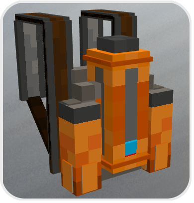
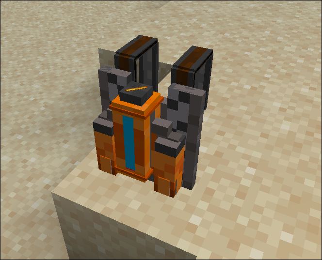
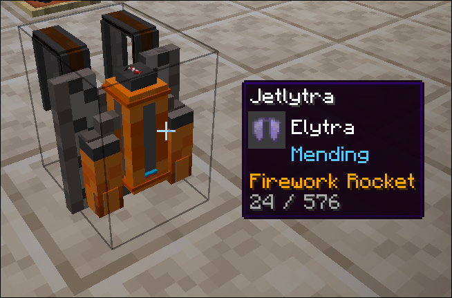
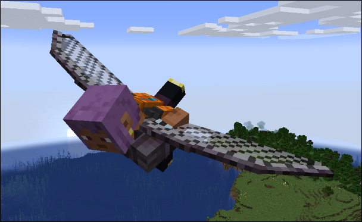
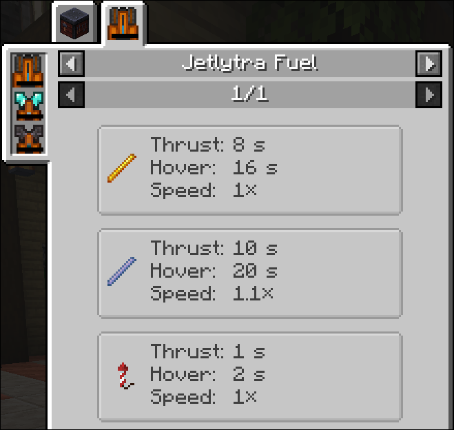
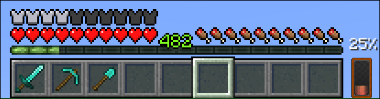
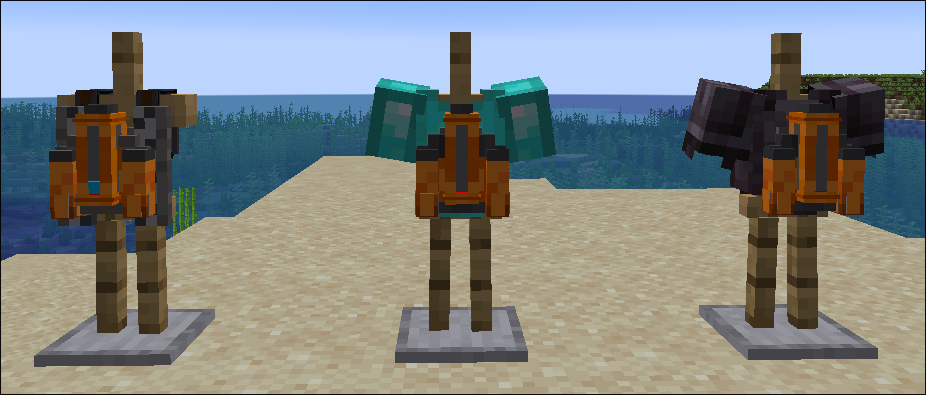

# Jetlyrta mod

## What is this
This is a minecraft mod that implements a special wearable jetpack. Jetpack that can be equiped with elytra wings.
Goal was to create a jetpack that will satisfy my own needs, but in the end, it's highly customizable so it will probably 
satisfy your needs too.

It improves building experience by allowing you to hover in the air but also improves exploration - no more swapping between
elytra and jetpack.

### Dependencies

- NeoForge 21.1 (for mod loading)
- GeckoLib 4.7 (for model/animation rendering) - **not required on dedicated server**

### How it works

Jetlytra can work in a few modes:
- Jetpack mode - press jump and you're off to the skies
- Hover mode - will suspend you in the air (using less fuel)
- Elytra mode - Elytra flight

### Features

- Jetpack can be toggled with a keybind (elytra will still work)
- When jetpack if off, taping jump key when falling will open wings (like vanilla)
- Jump key while swimming will boost you forward
- Jump key in hover mode will slowly move you upwards
- Jump key in elytra mode will add thrust - no need for fireworks (they work too)
- Crouching in elytra mode will deactivate elytra and put you in hover mode
- Different thrust particles for fuel types 

**Available keybinds:**
- Jetpack toggle button
- Hover mode toggle button (crouching won't affect hover mode)
- Elytra mode toggle (activate elytra flight (almost) any time)

Also, for Controlify there are two additional keybinds:
- Additional thrust key - active only when player is in the air. Works well if you want to use already bound trigger for thrusting
- Additional elytra mode key - also working when player is in the air.

### Placing on the ground

To refuel/modify, you need to hold Jetlytra in hand and crouch+rclick on the block. 
This will place Jetlytra as a block on the ground.

If you look at the block, tooltip will be displayed, giving you more info about the state of the Jetlytra

To pick it up, crouch+rclick again or break it with anything to get item back.

### Elytra

When you craft Jetlytra item, it only works as a jetpack. 
If you want elytra flight, you need to place Jetlytra on the ground and right click on it with elytra in hand.
Elytra will be a part of jetpack and will allow you to fly. Don't worry, you can get it back by right clicking again.

Elytra added to the jetpack will take damage during flight - just as normal one does.
Unbreaking enchantment is respected. If your elytra is enchanted with mending, it will be repaired just as if you're wearing it (no need to take it out of jetpack for repair)

You can hover mouse on the Jetlytra item to see if elytra is still there and how damaged it is.

### Fuel

To refuel, first place Jetlytra on the ground. Then, when you right click on it with fuel item in hand, it will consume
the entire held stack.

**If you double click with fuel - it will take all available fuel items from your inventory.**

You can also add fuel from the top side with hopper/any other item input mechanics.

Jetpack block will emit analog redstone signal depending on the fuel level. 
- 0 - 0% fuel
- 1-14 - 1% to 99% fuel
- 15 - 100% fuel

By default, there are three types of fuel:
- Blaze rods
- Breeze rods
- Firework rocket (all flight times have the same properties)

Jetpack can hold up to 9 stacks of one type of fuel. If you add one type, you can only add more fuel of the same type.
Add 1 stack of blaze rods - you can only add more blaze rods (until all are used up).

Each fuel type causes different particles and different thrust speeds.
You can add your own/modify existing with a data pack.

There's a JEI integration that will let you check available fuel types and their properties.

### GUI

There are a few elements that you can configure on the HUD:
- Block Tooltip
- Fuel percentage
- Fuel gauge
- Low fuel level warning

All configuration options are available in the `Mods -> Jetlytra -> Config`

> [!TIP]
> All of these can be toggled, moved around and scaled to your liking. For warning level, you can adjust the exact 
> fuel level when it's triggered. It will only appear when jetpack is enabled 

### Variants

There are 3 variants of Jetlytra:
- Jetlytra - standard type, provides Iron level armor
- Diamond Jetlytra - provides Diamond level protection
- Netherite Jetlytra - provides Netherite level protection (+ fireproof)

None of these can be enchanted. But also none of them break.

### Compatibilities

- Create - dedicated mechanical crafting recipes, replaces vanilla ones
- Curios - Basic Jetlytra variant is wearable in "back" slot
- Controlify - Gamepad controls
- JEI - Crafting, Fuel info
